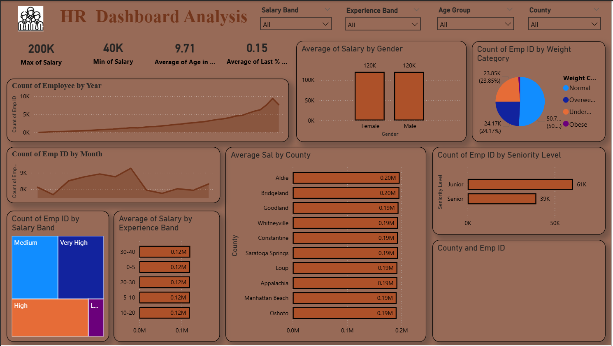

# HR Analytics Dashboard – Workforce & Salary Insights

##  Project Overview
This Power BI project analyzes HR data to understand employee distribution,
salary patterns, and workforce trends to support data-driven HR decisions.

##  Business Questions Answered
- How does average salary vary by gender, experience, and country?
- What are the employee hiring trends over time?
- Which seniority levels have the highest number of employees?

##  Tools & Skills Used
- Power BI
- DAX
- Data Modeling
- Data Visualization
- HR Analytics

##  Dashboard Preview

